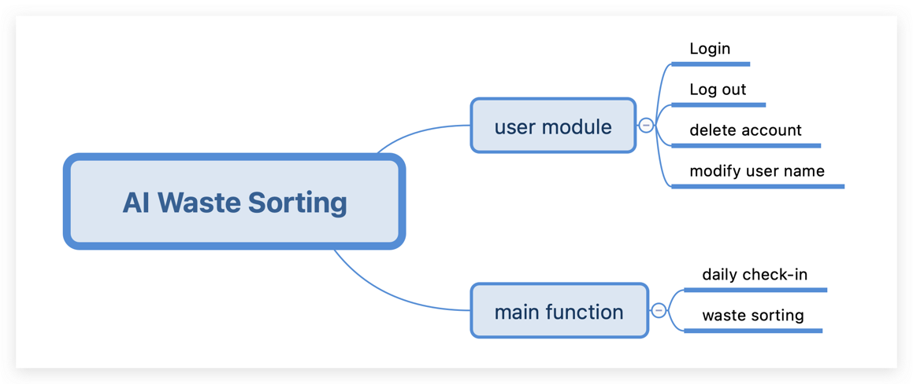
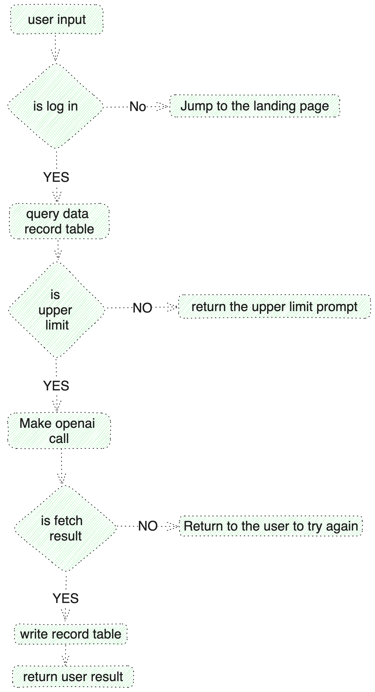
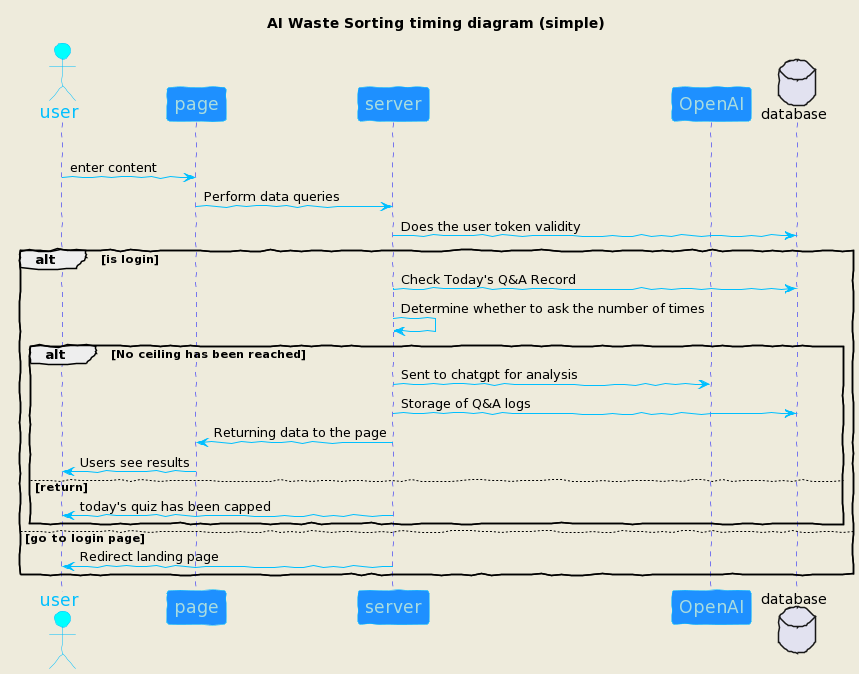

# Project Name: AI Waste Sorting

## Online-Visit

First I've deployed to the server，You can access the experience online by clicking [here](http://itmd542-fp-yifan.someget.work/)

## Project Description

In the current context of environmental protection and sustainable development, waste classification and management have
become important global issues. However, the dissemination of knowledge and implementation of waste classification face
several challenges. Many residents are not aware of how to correctly classify waste, which may result in
ineffective waste sorting.
To address these issues, I plan to develop a new website. This website will serve residents, who can use the website to
access waste classification information and improve their waste sorting awareness and skills.
We believe that through this website, we can enhance the efficiency and accuracy of waste classification, We look
forward to this project making a contribution to the environmental cause and bringing tangible benefits to our
community.

This project is a web application developed using Express and Node.js.
It showcases a simple yet functional interface, Tailored with a responsive design, it leverages Pug as the template
engine and TailwindCSS for styling, offering a seamless user experience across different devices.

## Technology Stack

### Backend

- **Node.js**: A JavaScript runtime built on Chrome's V8 JavaScript engine, facilitating the execution of JavaScript
  code server-side.
- **Express**: A minimal and flexible Node.js web application framework, providing a robust set of features for web and
  mobile applications.

### Frontend

- **Pug**: A high-performance template engine implemented with JavaScript for Node.js and browsers, known for its clean
  and simple syntax.
- **Tailwind CSS**: A utility-first CSS framework for creating custom designs directly in your markup.

### Database

- **SQLite**: A C-language library that implements a small, fast, self-contained, high-reliability, full-featured, SQL
  database engine.

### AI Model

- **OpenAI GPT-4**: The latest generation of artificial intelligence language models developed by OpenAI, capable of
  understanding and generating human-like text.

### ORM Tool

- **TypeORM**: An ORM that can run in Node.js, Browser, Cordova, PhoneGap, Ionic, React Native, NativeScript, Expo, and
  Electron platforms and can be used with TypeScript and JavaScript (ES5, ES6, ES7, ES8).

### Authentication Framework

- **GitHub Authentication**: Utilizes GitHub's OAuth 2.0 authentication system to enable users to authenticate with
  GitHub credentials, providing a secure and streamlined sign-in process.

This technology stack has been curated to support the development of a modern, efficient, and user-friendly web
application, leveraging the latest advancements in web technology and artificial intelligence.

## Data Structure

```sql
create table user
(
    id        bigint unsigned auto_increment comment 'pk' primary key,
    uid       bigint unsigned default 0 not null comment 'uid',
    user_name varchar(128) default ''                not null comment 'jwt token',
    token     varchar(128) default ''                not null comment 'jwt token',
    mtime     timestamp    default CURRENT_TIMESTAMP not null on update CURRENT_TIMESTAMP comment 'update time',
    ctime     timestamp    default CURRENT_TIMESTAMP not null on update CURRENT_TIMESTAMP comment 'create time',
    constraint uk_uid unique (uid),
    index     ix_token (token),
    index     ix_mtime (mtime),
    index     ix_ctime (ctime)
) comment 'user';

create table qa_record
(
    id       bigint unsigned auto_increment comment 'pk' primary key,
    uid      bigint unsigned default 0 not null comment 'uid',
    question varchar(500) default ''                not null comment 'question',
    answer   varchar(500) default ''                not null comment 'answer',
    mtime    timestamp    default CURRENT_TIMESTAMP not null on update CURRENT_TIMESTAMP comment 'update time',
    ctime    timestamp    default CURRENT_TIMESTAMP not null on update CURRENT_TIMESTAMP comment 'create time',
    index    ix_mtime (mtime),
    index    ix_ctime (ctime)
) comment 'qa_record';

create table daily_check
(
    id         bigint unsigned auto_increment comment 'pk' primary key,
    uid        bigint unsigned default 0 not null comment 'uid',
    check_date varchar(32) default ''                not null comment 'check_date e.g. 20230204',
    mtime      timestamp   default CURRENT_TIMESTAMP not null on update CURRENT_TIMESTAMP comment 'update time',
    ctime      timestamp   default CURRENT_TIMESTAMP not null on update CURRENT_TIMESTAMP comment 'create time',
    index      ix_mtime (mtime),
    index      ix_ctime (ctime),
    index      ix_uid_date (uid, check_date)
) comment 'qa_record';
```

## Function Introduction



## Waste Sorting core flow chart



## Waste Sorting Core Timing Chart



## 接口文档

## Development Environment

- **Operating System**: Windows 11/macOS Big Sur/Ubuntu 20.04
- **Node.js Version**: 21.6.2
- **Editors Used**: Visual Studio Code
- **Key Dependencies**:
    - Express for the web server framework
    - MongoDB and SQLite for database management
    - Pug for server-side template rendering
    - TailwindCSS for utility-first CSS styling
- **Other Tools**:
    - Nodemon for automatic server restarts during development
    - Debug for debugging purposes

## Installation/Running Instructions

To get this project up and running on your local machine, follow these steps:

1. **Clone the repository**:
   ```
   git clone https://github.com/oreoft/ITMD542-S24.git
   ```
2. **Navigate to the project directory**:
   ```
   cd final-project
   ```
3. **Install dependencies**:
   ```
   npm install
   ```
4. **Set up environment variables**:
   Create a `.env` file in the root directory and populate it with ai config variables. `Waste_AI_TOKEN=xxxx`(your
   config)

4**Start the application**:

- For development:

```
npm run dev
```

- For production:

```
npm start
```

## References

- Express Documentation: https://expressjs.com/
- SQLite Documentation: https://www.sqlite.org/docs.html
- TailwindCSS Documentation: https://tailwindcss.com/docs
- Node.js Documentation: https://nodejs.org/en/docs/
